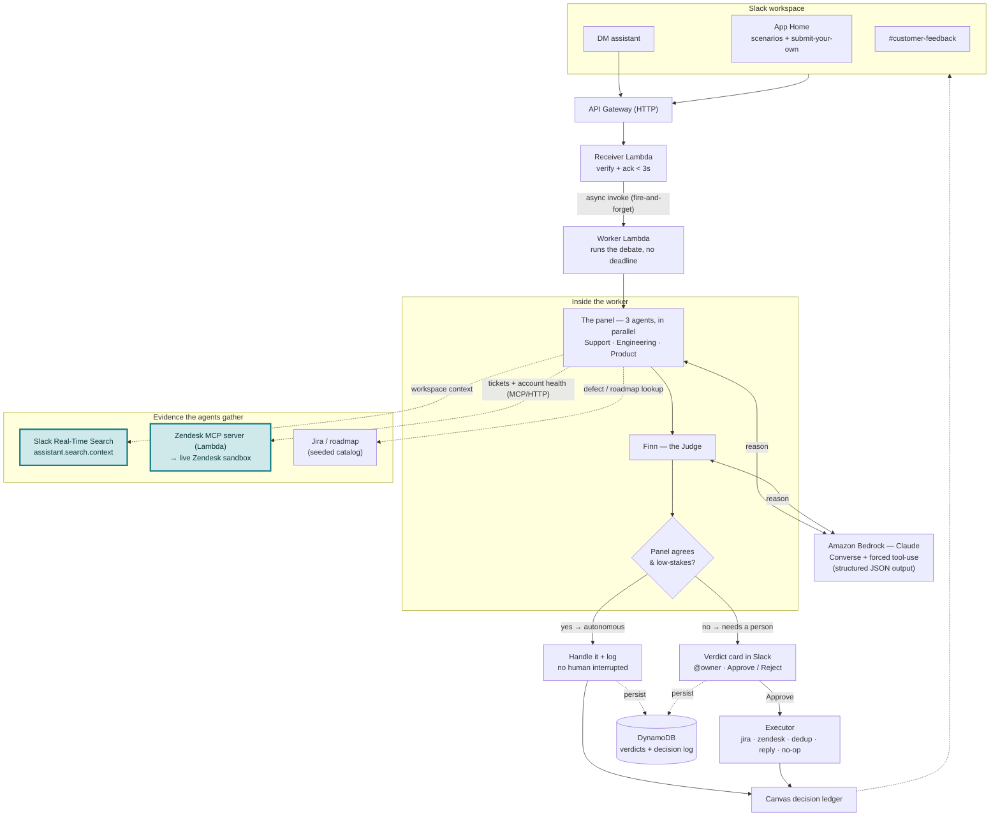

# Finn — Architecture

Product feedback lands in Slack. Finn convenes a panel of specialist agents,
they debate it grounded in real workspace data, and Finn either handles the call
itself or routes it to a human — recording every decision. The Slack-facing logic
is transport-agnostic: the exact same flow runs under **Socket Mode** locally and
behind **API Gateway + Lambda** in the deployed (judge-facing) build.

## How to read it

1. **Feedback enters** from `#customer-feedback`, the App Home tab, or a DM. In the
   deployed build the **receiver** verifies the request and acks Slack in under 3
   seconds, then fire-and-forget invokes the **worker** — because a Lambda can be
   frozen the instant it responds, so "ack now, keep working" has to be two
   invocations. (In Socket Mode one long-lived process does both inline.)
2. **The panel debates.** Three persona agents run in parallel on Claude via
   Bedrock, each returning structured JSON through a forced tool call. Each
   grounds its argument in real data before taking a position.
3. **Finn judges and routes.** `routeVerdict` is the pivot: if the panel agrees
   and the action is low-stakes, Finn handles it and logs it. If they disagree or
   the action is consequential, it posts a verdict card, tags the owner, and waits
   for Approve/Reject. Nothing external happens without a human on those.
4. **Every decision is recorded** to a Slack Canvas ledger, and (in the deployed
   build) mirrored to DynamoDB so it survives across separate Lambda invocations.

## The two grounding sources worth calling out (highlighted)

- **Slack Real-Time Search API** (`assistant.search.context`) — the agents pull
  live in-workspace context, each scoped to its own channels.
- **A Zendesk MCP server we built ourselves**, running as its own Lambda and
  talking to a live Zendesk sandbox for ticket volume and account health.

Jira/roadmap is still a seeded catalog behind the same typed tool boundary, ready
to swap for a live MCP.
